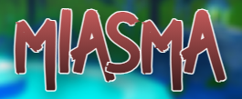

# 

A first-person horror-stealth game developed in Unity as part of Spring 2021 UC Davis ECS 198L Game Programming class final. 

### You can download the built version of the game at https://jeffk1m.itch.io/miasma

#

### Check out the trailer:

Also check out the [Press Kit](Press%20Kit.pdf)

#

### Due to file size limits, the game's repo has been moved and is now found at https://gitlab.com/adunn27/ecs189l-miasma
